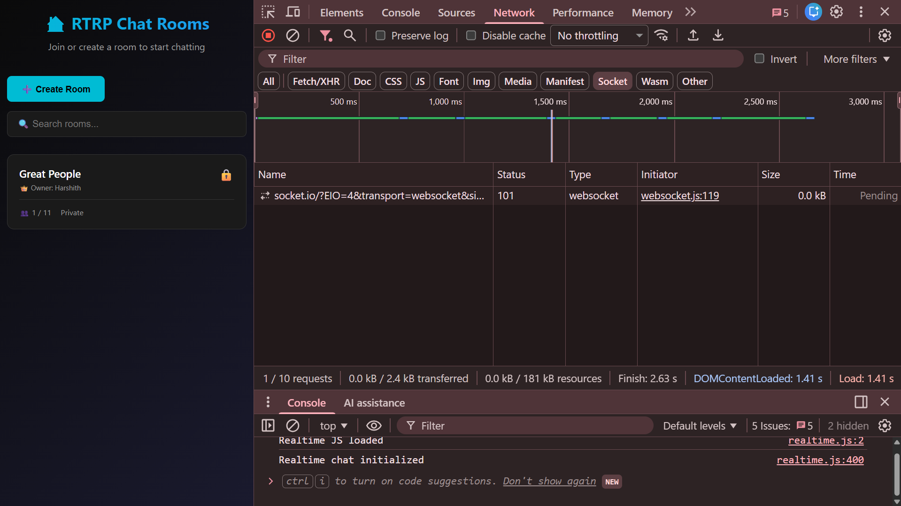

# Open Chat - Real-Time Room-Based Chat Application 🚀

A feature-rich, real-time chat application with room-based architecture, built using **Node.js**, **Express**, and **Socket.IO**. Experience seamless communication with public/private rooms, typing indicators, and a stunning dark-themed UI optimized for all devices.

---

## 🔹 Features

### Room-Based Chat System
- Create custom chat rooms with unique names
- Browse all available rooms before joining
- Seamless room switching without page reloads
- Rooms exist only while users are active (no database required)
- Automatic room deletion when the last user leaves

### Public & Private Rooms
- **Public Rooms**: Open for anyone to join
- **Private Rooms**: Password-protected for exclusive access
- Server-side password validation ensures security

### Room Management
- Room creator becomes the owner with special privileges
- Owner name displayed in room listings
- Set maximum user limits per room (2-50 users)
- Visual occupancy indicators (e.g., `3 / 10`)
- System-wide limit of 101 rooms to prevent overload

### User Experience
- Unique usernames required within each room
- Real-time typing indicators ("User is typing...")
- Live user count updates
- Room status indicators (Public/Private)
- Available slots visualization
- Instant join/leave notifications

### Modern UI/UX
- Dark theme with glassmorphism effects
- Fully responsive design (mobile, tablet, desktop)
- Smooth animations for room transitions and messages
- Intuitive navigation with clear visual hierarchy

---

## 🛠️ Tech Stack

| Layer | Technology |
|-------|-----------|
| **Frontend** | HTML5, CSS3, Vanilla JavaScript |
| **Backend** | Node.js, Express.js |
| **Real-time** | Socket.IO (WebSocket) |
| **Deployment** | Render (Cloud Platform) |

---

## 📂 Project Structure
```
Open_Chat_Application/
│
├── uiLayer/                   # Frontend files
│   ├── homeView.html          # Main chat interface
│   ├── design.css             # Styling and animations
│   └── realtime.js            # Client-side Socket.IO logic
│
├── rtrpServer.js              # Express + Socket.IO server
├── package.json               # Dependencies
├── package-lock.json
├── screenshots/               # UI screenshots
│   ├── chat-room.png
│   ├── create-room.png
│   ├── desktop-view.png
│   ├── mobile-view.png
│   ├── render-deploy.png
│   └── websocket-101.png
│
└── README.md
```

---

## 🧠 System Architecture
```
┌─────────────┐          HTTP/WebSocket          ┌─────────────┐
│   Browser   │ ◄──────────────────────────────► │   Node.js   │
│  (Client)   │                                  │    Server   │
└─────────────┘                                  └─────────────┘
      │                                                 │
      │  1. HTTP GET (homeView.html)                    │
      │────────────────────────────────────────────────►│
      │                                                 │
      │  2. Establish WebSocket Connection              │
      │◄ ─ ─ ─ ─ ─ ─ ─ ─ ─ ─ ─ ─ ─ ─ ─ ─ ─ ─ ─ ─ ─ ─ ─ ►│
      │                                                 │
      │  3. Create/Join Room                            │
      │────────────────────────────────────────────────►│
      │                                                 │
      │  4. Real-time Messages & Updates                │
      │◄────────────────────────────────────────────────│
```

**Key Components:**
- **Client**: Sends messages, joins rooms, displays UI
- **Server**: Manages rooms, broadcasts messages, validates actions
- **Socket.IO**: Maintains persistent WebSocket connections
- **Room Manager**: Tracks active rooms, users, and metadata

---

## ▶️ How to Run Locally

### Prerequisites
- Node.js (v14 or higher)
- npm (Node Package Manager)

### Installation Steps

1. **Clone the repository:**
```bash
   git clone https://github.com/Harshith1702/Open_Chat_Application.git
```

2. **Navigate to project directory:**
```bash
   cd Open_Chat_Application
```

3. **Install dependencies:**
```bash
   npm install
```

4. **Start the server:**
```bash
   npm start
```

5. **Open in browser:**
```
   http://localhost:4000
```

---

## 🌐 Live Demo

🔗 **[Try Open Chat Live](https://open-chat-application-ubti.onrender.com)**

> **Note:** Hosted on Render's free tier. Initial load may take 30-60 seconds if the service is idle.

---

## 📸 Screenshots

### 🖥️ Desktop View


*Spacious layout with room list sidebar and chat area*
<br><br>
### 📱 Mobile View

<p align="center">
  
</p>

*Optimized for touch interactions and smaller screens*
<br><br>
### 🏠 Create Room Interface


*Intuitive room creation with all options visible*
<br><br>
### 💬 Active Chat Room


*Real-time messaging with typing indicators and user list*
<br><br>
### 🔌 WebSocket Connection


*Browser DevTools showing an active WebSocket (HTTP 101 upgrade) connection via Socket.IO*
<br><br>
### ☁️ Cloud Deployment


*Live deployment on Render platform*

<br>
---

## 🎯 Learning Outcomes

This project demonstrates proficiency in:

- **WebSocket Communication** - Bidirectional real-time data transfer
- **Event-Driven Architecture** - Socket.IO event handling
- **State Management** - Client-side and server-side synchronization
- **Responsive Design** - Mobile-first CSS approach
- **Room-Based Architecture** - Multi-room chat system design
- **Security Fundamentals** - Password validation, input sanitization
- **Cloud Deployment** - Auto-deployed on Render via GitHub integration
- **Git Workflow** - Version control and collaboration

---

## 🔐 Security Considerations

- Server-side room password validation
- Basic input validation to prevent malformed data
- Controlled room limits to avoid server overload
- No persistent storage (reduces attack surface)

> Note: This project focuses on real-time systems learning, not production-grade security.

---

## 🚀 Future Enhancements

- Message persistence with MongoDB
- User authentication (OAuth/JWT)
- File/image sharing capabilities
- Message reactions and emojis
- Private direct messaging
- Room moderation tools
- Message edit/delete functionality
- Push notifications

---

## 🤝 Contributing

Contributions are welcome! Please follow these steps:

1. Fork the repository
2. Create a feature branch (`git checkout -b feature/AmazingFeature`)
3. Commit changes (`git commit -m 'Add AmazingFeature'`)
4. Push to branch (`git push origin feature/AmazingFeature`)
5. Open a Pull Request

---

## 📚 Academic Note

This project is shared publicly for **educational and demonstration purposes**. 

**Academic Integrity Guidelines:**
- Cloning for learning and reference is encouraged
- Fork and modify for personal projects
- Direct submission as academic work may violate institutional policies
- Always cite sources and give proper attribution

---

## 👤 Author

**Padakanti Harshith**  
B.Tech Computer Science and Engineering  
🔗 GitHub: [@Harshith1702](https://github.com/Harshith1702)

---

## 📜 License

This project is licensed under the **MIT License**. See the [LICENSE](LICENSE) file for details.

---

## 🙏 Acknowledgments

- Socket.IO documentation and community
- Render for free hosting services
- Open-source contributors and testers

---

## 📞 Support

Found a bug? Have suggestions?  
- 🐛 [Report Issues](https://github.com/Harshith1702/Open_Chat_Application/issues)
- 💡 [Feature Requests](https://github.com/Harshith1702/Open_Chat_Application/issues/new)
- ⭐ Star this repo if you found it helpful!

---

<div align="center">

**Built with ❤️ by Harshith**

[](https://github.com/Harshith1702/Open_Chat_Application)
[](https://github.com/Harshith1702/Open_Chat_Application/fork)

</div>
